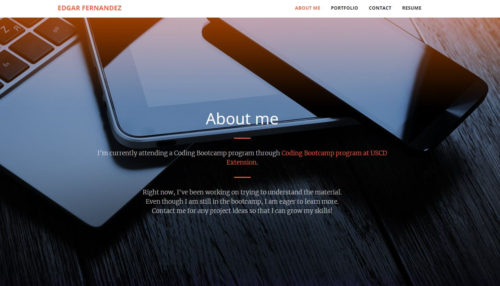

# React Portfolio

[Github Repo](https://github.com/HCTyler/ReactPortfolio)
[Deployed Application](https://hctyler.github.io/ReactPortfolio/)

## Description

A single page application showcasing my portfolio using React.

## Table of Contents

[Installation](#installation)

[Usage](#usage)

[License](#license)

## Installation

To install necessary dependencies for this project, run the following command:

> No steps needed to install.

## Usage

This website contains an about me, contact, portfolio and resume components.

## Questions

If you have any other questions about the repo, contact me at Edgar.fernand@outlook.com. You can find more of my work at [HCTyler](https://github.com/HCTyler)
